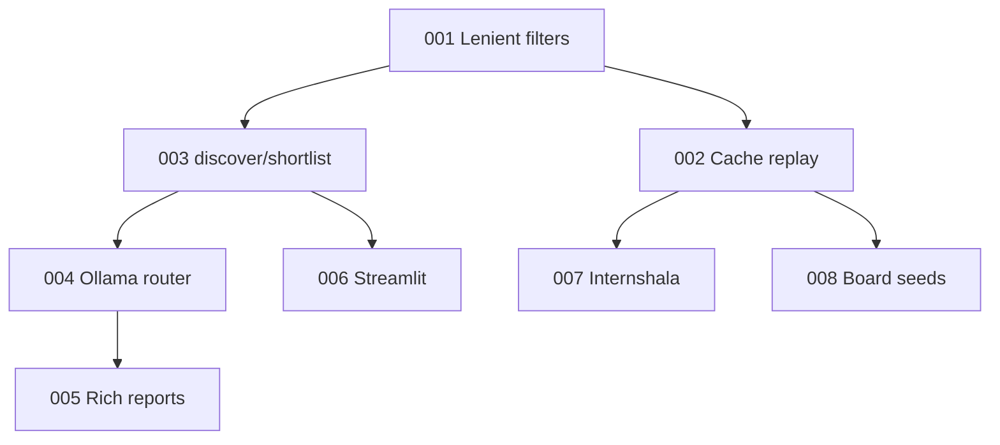

# Implementation issues (v1)

Parent: [PRD: AI Internship Intelligence Agent v1](../PRD-internship-intelligence-v1.md)

All issues: **`ready-for-agent`** · **AFK**

## Dependency order

| # | Issue | Blocked by |
|---|--------|------------|
| 001 | [Lenient filters + rank penalty](./001-lenient-filters-rank-penalty.md) | — |
| 002 | [Hybrid cache replay](./002-hybrid-cache-replay.md) | 001 |
| 003 | [discover / shortlist CLI](./003-discover-shortlist-cli.md) | 001 |
| 004 | [Dual Ollama routing](./004-dual-ollama-routing.md) | 003 |
| 005 | [Rich LLM coaching reports](./005-rich-llm-coaching-reports.md) | 004 |
| 006 | [Streamlit viewer](./006-streamlit-viewer.md) | 003 |
| 007 | [Internshala scraper](./007-internshala-scraper.md) | 002 |
| 008 | [Board seed list](./008-board-seed-list.md) | 002 |



## Publish to GitHub

When the repo has a remote:

```bash
gh label create "ready-for-agent" --color "0E8A16" 2>/dev/null || true

for f in docs/issues/00*.md; do
  gh issue create --title "$(head -1 "$f" | sed 's/# Issue [0-9]*: //')" \
    --label "ready-for-agent" \
    --body-file "$f"
done
```

Create issues in numeric order so "Blocked by" references can be updated to real `#NN` URLs after publish.
